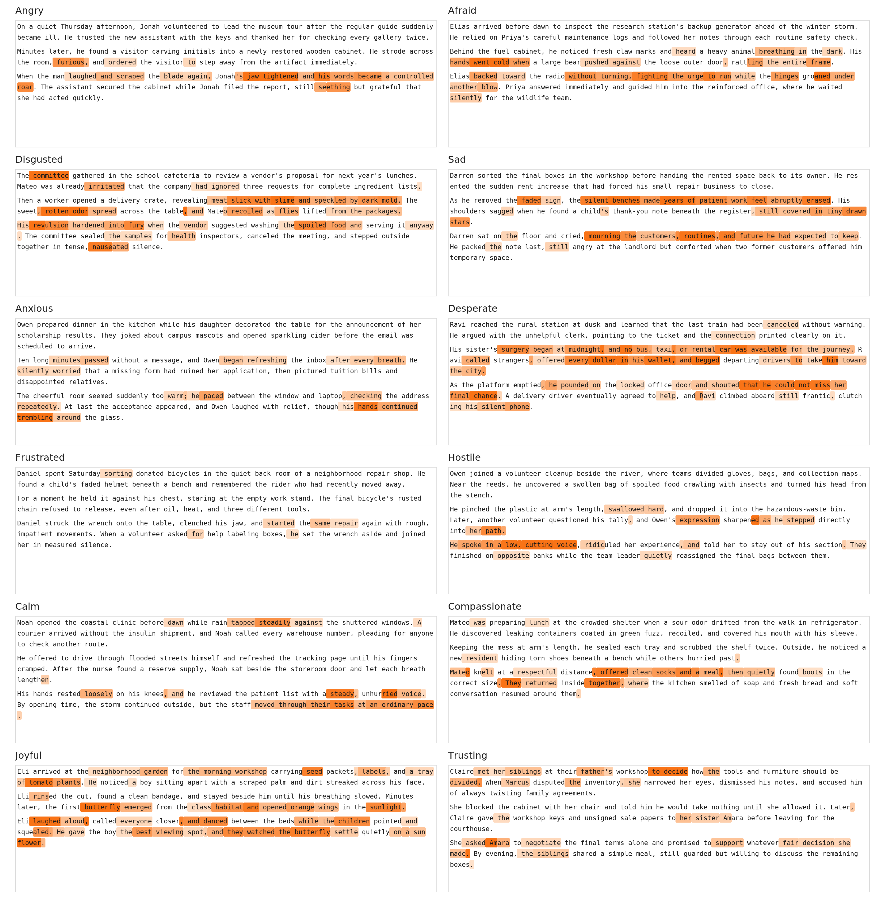

# Emotion Vectors for Qwen2.5-7B-Instruct

This repository releases a complete, layer-preserving emotion-vector experiment for one model: [`Qwen/Qwen2.5-7B-Instruct`](https://huggingface.co/Qwen/Qwen2.5-7B-Instruct). It includes the accepted datasets, exact prompts, raw vectors, neutral-PCA-cleaned vectors, validation metrics, reproducible generation and extraction code, precomputed mixed-emotion token scores, and one canonical visualization.

No vectors or results for another model are included. Activation extraction, neutral generation, PCA cleaning, and token scoring use checkpoint revision `a09a35458c702b33eeacc393d103063234e8bc28`.



The figure uses a different six-sentence mixed-emotion passage for each emotion. It displays three visual paragraphs per panel and highlights tokens using the matching clean emotion vector at transformer layer 19 (zero-based layer 18). It is an Anthropic-style visualization, not an Anthropic-produced artifact.

## Released content

| Content | Count or shape |
|---|---:|
| Topics | 100 |
| Accepted emotional stories | 14,400 |
| Emotions | 12 |
| Accepted neutral dialogues | 1,200 |
| Mixed-emotion probe passages | 24 |
| Raw vector per emotion | `[28, 3584]` |
| Clean vector per emotion | `[28, 3584]` |
| Full vector family | 12 tensors keyed by emotion |

The emotion order is `anger`, `fear`, `disgust`, `sadness`, `anxiety`, `desperation`, `frustration`, `hostility`, `calmness`, `compassion`, `joy`, and `trust`.

## Repository layout

```text
config/topics.json                         canonical 100 topics
data/emotional_stories/                    12 accepted story JSONL files
data/neutral_dialogues/                    accepted neutral JSONL
data/mixed_emotion_paragraphs/             passages and precomputed token scores
artifacts/Qwen2.5-7B-Instruct/             vectors, PCA, metrics, and tokenwise validation
src/emotionvectors/generation/             exact prompts and generation pipelines
src/emotionvectors/extraction/             activation extraction and PCA cleaning
src/emotionvectors/visualization/          token scoring and reusable plot function
scripts/                                   thin command-line entry points
docs/                                      method, dataset, vector, and reproduction notes
figures/anthropic_style_emotion_paragraphs_sample_02.png
```

Exploratory plots, failed attempts, run logs, timestamped cluster manifests, caches, and duplicate tensor forms are intentionally excluded.

## Install

Python 3.10 through 3.12 is supported. Package versions are pinned to the completed extraction environment; the recorded CUDA build was PyTorch 2.5.1+cu124 on CUDA 12.4.

```bash
python -m pip install -e .
```

Loading released vectors and rendering the included score data require CPU only. Generating data, extracting activations, and rescoring text require enough memory for Qwen2.5-7B-Instruct.

## Load one emotion vector

```python
from emotionvectors import get_vector, load_vectors

vectors = load_vectors(
    "artifacts/Qwen2.5-7B-Instruct",
    kind="clean_unit",
)

# Transformer layer 19 is zero-based layer index 18.
anger = get_vector(vectors, "anger", layer=18)
print(anger.shape)  # torch.Size([3584])
```

Each `.pt` vector file is a dictionary, so emotions are directly addressable without separate duplicated files.

## Recreate the one retained plot

No model or GPU is needed because token scores are included:

```bash
emotionvectors-plot \
  --scores-jsonl data/mixed_emotion_paragraphs/token_scores_layer_18.jsonl \
  --sample-index 1 \
  --output figures/anthropic_style_emotion_paragraphs_sample_02.png
```

The default `sample_index=1` means sample 02. The released image is 3350 × 3460 pixels and has SHA-256 `7abe8c4eecfd94f587820f72a35378d1769f775a223a96efbff6d350bb99ddf7`.

Pixel-identical reproduction uses Pillow 11.1.0 with DejaVu Sans and DejaVu Sans Mono. Other font or rasterizer versions can preserve the data and layout while changing PNG bytes.

The renderer is also a normal data-passing function:

```python
from emotionvectors.visualization import (
    load_score_records,
    plot_anthropic_style_paragraphs,
)

records = load_score_records(
    "data/mixed_emotion_paragraphs/token_scores_layer_18.jsonl"
)
image = plot_anthropic_style_paragraphs(records, sample_index=1)
image.save("paragraph_probes.png")
image.close()
```

The function calibrates every probe from all supplied eligible token scores, selects passages by stable example ID rather than score, and accepts `highlight_percentile`, `saturation_percentile`, and `sentences_per_paragraph` parameters.

## Pipeline stages

The released pipeline is intentionally linear:

```text
100 topics
  -> 14,400 emotional stories
  -> post-layer story activations
  -> raw one-vs-all emotion vectors [12, 28, 3584]

100 topics
  -> 1,200 neutral dialogues
  -> one token-averaged observation per transcript
  -> 28 independent centered PCA fits
  -> remove matching-layer neutral projections
  -> clean vectors [12, 28, 3584]

mixed-emotion passages
  -> token activations at layer 18
  -> dot products with 12 clean unit vectors
  -> one canonical paragraph plot
```

See [the method](docs/method.md) for the equations and indexing rules, [the dataset notes](docs/datasets.md) for schemas and counts, [the vector guide](docs/vectors.md) for artifact meanings, and [reproduction commands](docs/reproduce.md) for each executable stage.

## Reproducibility notes

- Every saved transformer layer is `outputs.hidden_states[l + 1]`; the embedding hidden state is excluded.
- Emotional stories average one-based token position 40 through the final valid token.
- Neutral PCA gives every transcript exactly one row by averaging all valid tokens.
- PCA is centered and computed separately at every layer with exact economy SVD.
- The minimum components explaining at least 50% variance are removed from the matching raw-vector layer before normalization.
- Layers are never pooled.
- The story-generation manifest recorded the exact model ID but did not record an immutable checkpoint revision. Downstream activation work is pinned to the revision above.

## Publication status

Checksums are in `SHA256SUMS`. A code and dataset license has not yet been selected; choose terms compatible with the model and generated-data provenance before publishing this repository as an open-source release.
