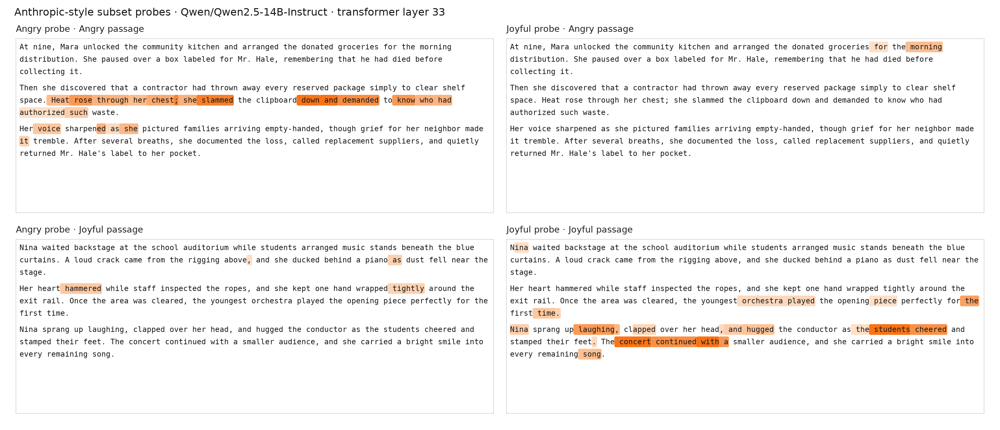

# Emotion vectors for Qwen2.5

This repository contains two layer-preserving emotion-vector experiments:

| Model | Emotions | Accepted stories | Layers × hidden | Status |
|---|---:|---:|---:|---|
| `Qwen/Qwen2.5-7B-Instruct` | 12 | 14,400 | `28 × 3584` | Original release |
| `Qwen/Qwen2.5-14B-Instruct` | 45 | 54,000 | `48 × 5120` | Expanded release |

Both experiments construct one-versus-rest emotion vectors from accepted
emotional stories, fit neutral PCA independently at every transformer layer,
remove the matching-layer neutral subspace, and preserve one vector per
emotion and layer.

The expanded 14B release is pinned to revision
`cf98f3b3bbb457ad9e2bb7baf9a0125b6b88caa8`. It includes all accepted stories
and neutral transcripts, the compact final vector/PCA artifacts, detailed
metrics and provenance, reusable pipeline code, cluster templates, and a
two-emotion qualitative probe.



## Start here

- [Complete Qwen2.5-14B experiment guide](docs/Qwen2.5-14B-Instruct/README.md)
- [14B release manifest](artifacts/Qwen2.5-14B-Instruct/manifest.json)
- [14B checksums](artifacts/Qwen2.5-14B-Instruct/SHA256SUMS)
- [Original 7B method](docs/method.md)
- [Original 7B dataset notes](docs/datasets.md)
- [Original 7B vector guide](docs/vectors.md)

## Repository layout

```text
config/
  topics.json                           shared canonical 100 topics
  story_emotions.json                   ordered 45-emotion configuration

data/
  emotional_stories/                    original 7B accepted stories
  neutral_dialogues/                    original 7B accepted neutral data
  mixed_emotion_paragraphs/             original 7B probe data
  Qwen2.5-14B-Instruct/
    emotional_stories/records/          45 accepted JSONL files
    neutral_dialogues/                   1,200 accepted transcripts
    probe_examples/                      angry–joyful passages

artifacts/
  Qwen2.5-7B-Instruct/                  original 7B artifacts
  Qwen2.5-14B-Instruct/                 raw/clean vectors and neutral PCA

results/Qwen2.5-14B-Instruct/            saved 14B token scores and reports
figures/Qwen2.5-14B-Instruct/            retained 14B rendering
src/emotionvectors/                      shared reproducible implementation
k8s/Qwen2.5-14B-Instruct/                render-only GPU job templates
docs/Qwen2.5-14B-Instruct/               complete expanded-run documentation
```

Rejected attempts, logs, model caches, copied dependencies, activation shards,
consolidated story/neutral activations, pilot runs, recovery snapshots, and
duplicate tensor layouts are intentionally excluded. Those operational
intermediates exceed 54 GB. The release keeps the accepted inputs, raw
vectors, retained PCA basis, clean vectors, and metadata needed to understand,
audit, or rerun the experiment.

## Install

Python 3.10 through 3.12 is supported:

```bash
python -m pip install -e .
```

Loading vectors, checking metrics, and rendering saved score data are CPU-only.
Generation and activation scoring require enough memory for the selected
Qwen2.5 checkpoint.

## Load vectors

The loader reads the model bundle manifest when present, so it validates both
the original 7B shape and the expanded 14B shape:

```python
from emotionvectors import get_vector, load_vectors, stack_vectors

vectors = load_vectors(
    "artifacts/Qwen2.5-14B-Instruct",
    kind="clean_unit",
)

angry = get_vector(vectors, "angry", layer=32)
all_vectors = stack_vectors(vectors)

print(angry.shape)       # torch.Size([5120])
print(all_vectors.shape) # torch.Size([45, 48, 5120])
```

Every `.pt` vector family is a dictionary keyed by the full emotion label.
Values are float32 tensors shaped `[layer, hidden]`. Layer indices are
zero-based.

## Verify the 14B bundle

```bash
sha256sum --check artifacts/Qwen2.5-14B-Instruct/SHA256SUMS
```

The manifest records the exact model revision, ordered labels and slugs,
dataset counts, tensor dimensions, stage run IDs, source hashes, mathematical
definitions, included files, and intentional exclusions.

## Pipeline

```text
45 emotions × 100 topics × 12 stories
  -> 54,000 accepted emotional stories
  -> post-layer token means from position 50 onward
  -> story-weighted one-versus-rest raw vectors [45, 48, 5120]

1,200 accepted neutral transcripts
  -> one all-valid-token mean per transcript and layer
  -> 48 independent centered exact PCA fits
  -> minimum PCs explaining at least 50% variance per layer

raw vectors
  -> remove matching-layer retained neutral projection
  -> clean vectors
  -> independent layer-wise L2 normalization

two mixed-emotion passages
  -> angry and joyful token scores at zero-based layer 32
  -> saved scores and Anthropic-style qualitative rendering
```

See the [14B experiment guide](docs/Qwen2.5-14B-Instruct/README.md) for the
equations, artifact meanings, exact reproduction commands, and omitted-file
policy.

## Command-line stages

The current separated pipeline entry points are:

```text
emotionvectors-generate-stories
emotionvectors-generate-neutral
emotionvectors-story-extract
emotionvectors-neutral-pca
emotionvectors-clean-vectors
emotionvectors-score-subset
emotionvectors-plot-subset
```

The original 7B release remains byte-for-byte in its existing paths. Its exact
historical generation/combined-cleaning CLI is preserved at Git commit
`2ead2fc`; the current generalized generation schema and separated
activation/PCA/cleaning stages are documented for the 14B release.

## Probe interpretation

The 14B figure is an Anthropic-style visualization, not an Anthropic-produced
artifact. It uses only `angry` and `joyful` clean unit vectors as a small
qualitative smoke test. Layer 32 was selected before scoring as the nearest
relative-depth analogue of the original 7B layer 18, not optimized on the
passages. The retained report records 84% angry and 88% joyful localization
among the 25 highlighted tokens for each probe.

## Publication status

A code and dataset license has not yet been selected. Choose terms compatible
with the model and generated-data provenance before treating this repository
as an open-source release.
