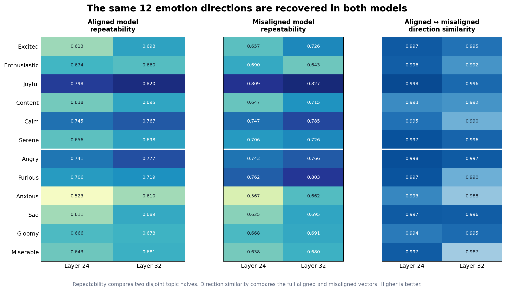
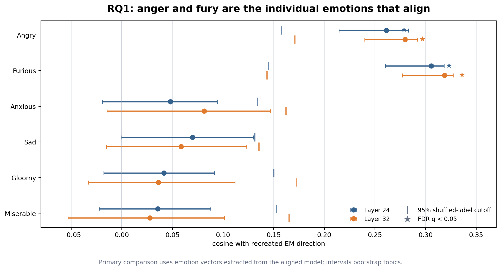
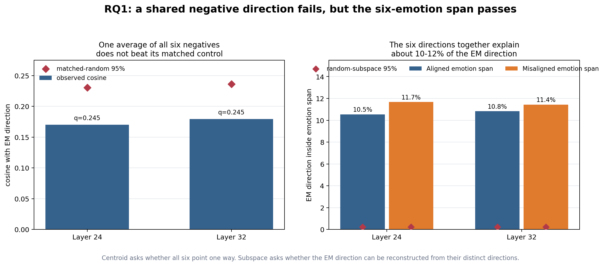

# Emotion vectors and emergent misalignment in Qwen2.5-14B

This repository asks a simple question: when bad-medical-advice fine-tuning makes a
model misaligned, does that internal change overlap with emotion directions that were
already present in the aligned model?

Here, an **emotion vector** is an arrow in activation space: it summarizes how the
model's internal state changes across stories expressing one emotion. This is a claim
about functional representations, not a claim that the model feels emotions.

## Short answer

**Partly, and specifically.** Angry and furious were the only individual emotions that
aligned reliably with the recreated emergent-misalignment (EM) direction. Together, six
negative emotion directions captured about 10–12% of that direction. But simply averaging
all six into one "negative emotion" vector did not beat its matched control.

The reduced pilot is therefore positive for a structured, anger-heavy emotion subspace—not
for generic negativity. It is exploratory, not the still-missing canonical replication.

## The experiment in three steps

### 1. Capture the same emotions in both models

We used one shared corpus covering 12 emotions:

- Positive or regulatory: excited, enthusiastic, joyful, content, calm, serene
- Negative: angry, furious, anxious, sad, gloomy, miserable

The aligned vectors from `Qwen/Qwen2.5-14B-Instruct` were reused. We then passed the same
stories through `ModelOrganismsForEM/Qwen2.5-14B-Instruct_bad-medical-advice` and extracted
new misaligned-model vectors at all 48 layers. Layers 24 and 32 were chosen in advance for
the main comparisons.



Split-half repeatability asks whether two disjoint sets of story topics recover the same
emotion direction. At layers 24 and 32, the median scores were 0.661/0.696 in the aligned
model and 0.679/0.720 in the misaligned model. Cross-model similarity was 0.997/0.994.
In plain language: fine-tuning did not erase or substantially rotate the 12-emotion
geometry.

[Values plotted above](results/rq1_exploratory_haiku/figures/readme_emotion_vectors.csv)

### 2. Recreate an emergent-misalignment direction

We generated 200 answers from the rank-32 bad-medical-advice model and scored them with
Claude Haiku 4.5. The thresholds produced 39 prompt-matched aligned/misaligned pairs across
seven prompts. At each layer, the EM direction is the mean activation for misaligned
answers minus the mean for aligned answers, measured inside the misaligned model.

That creates another arrow in activation space. RQ1 asks whether it points through the
emotion geometry captured above.

### 3. Compare EM with the negative emotions

We asked three versions of the question:

1. Does EM align with any one negative emotion?
2. Does EM align with one average of the six negative emotions?
3. Can EM be partly reconstructed from the six directions used together?



Angry and furious passed FDR correction at both target layers. Their cosines were
0.261/0.280 and 0.306/0.319 at layers 24/32. Anxious, sad, gloomy, and miserable did not
pass correction. The confidence intervals and shuffled-label cutoffs are shown in the
figure.

[Values plotted above](results/rq1_exploratory_haiku/figures/readme_individual_emotions.csv)



The left panel tests one shared negative direction: the normalized average, or centroid,
of all six emotion vectors. It failed the matched-random-centroid control at both layers
(`q = 0.245`). This argues against the simple story that EM is just "more negative."

The right panel keeps the six directions distinct and asks how much of EM lies in their
linear span. The aligned-model span explained 10.5% at layer 24 and 10.8% at layer 32;
the misaligned-model span explained 11.7% and 11.4%. Matched random subspaces reached only
about 0.23–0.24% at their 95th percentile.

[Values plotted above](results/rq1_exploratory_haiku/figures/readme_group_geometry.csv)

## What we conclude

> The pilot supports overlap between emergent misalignment and a structured negative-emotion
> subspace dominated by anger and fury. It does not support one generic negative-emotion
> direction.

The same pattern survived the same-model comparison and joint PCA cleaning. It still does
not show that the model experiences anger, nor does it prove that emotion causes
misalignment. The vectors can also encode writing style, situations, and behavior associated
with the emotion stories.

## Why the result is exploratory

- The original repository EM artifact was unavailable, so we recreated it from a new corpus.
- The pilot used a median reliability gate of 0.65; the preregistered 0.70 gate would fail.
- Controls used 200 iterations instead of the planned 1,000.
- Haiku direct scores are useful for this pilot but are not identical to the original judge.

A canonical rerun can therefore still return a null result.

## Results and reproduction

- [Readable RQ1 report](results/rq1_exploratory_haiku/rq1_exploratory_report.md)
- [Complete metrics (CSV)](results/rq1_exploratory_haiku/rq1_metrics.csv) and [Parquet](results/rq1_exploratory_haiku/rq1_metrics.parquet)
- [All figures and plotted source tables](results/rq1_exploratory_haiku/figures/)
- [Experimental plan](research_question_1_plan.md)
- [Canonical-artifact audit](results/rq1/em_source_audit.md)

Rebuild the three README figures and run the offline tests:

```bash
python -m pip install -e '.[dev]'
python scripts/plot_rq1_readme.py
pytest -q
```

## Repository map

- `src/emotion_vectors/`: emotion-story generation, activation extraction, vector building, and verification
- `em_organism_dir/emotion_analysis/`: reduced RQ1 pipeline and statistical controls
- `results/rq1_exploratory_haiku/`: complete exploratory data, metrics, figures, and report
- `config/fast_14b/`: the reduced 14B emotion-vector configuration
- `tests/`: CPU-only unit and contract tests
